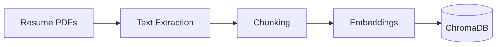
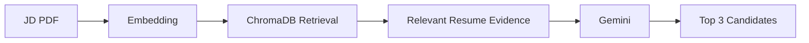
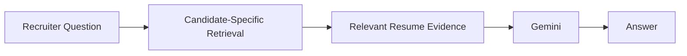

# 📄 AI-Powered Resume Matching


An AI-powered recruiter assistant built with **Streamlit, RAG, and Google Gemini** that matches candidate resumes against a Job Description (JD) and answers follow-up questions about individual candidates.

## 📌 Project Purpose

This project demonstrates how **RAG, semantic search, vector databases, and LLMs** can be combined to build an AI-powered resume matching workflow.

It is a prototype of an AI-assisted recruitment workflow for **JD-based candidate discovery and candidate-specific Q&A**.

## 🖼️ Demo Output

### 1. Upload a Job Description


### 2. Top 3 matching candidates


### 3. Candidate follow-up Q&A


## ✨ Features

- Upload a Job Description PDF
- Get a ranked **Top 3 candidate list** grounded in resume evidence
- Ask follow-up questions about a specific candidate
- Automatic LLM fallback from Gemini to a Hugging Face model

## 🧠 How It Works

The app uses **Retrieval-Augmented Generation (RAG)**: instead of asking an LLM to judge resumes from memory, it retrieves the most relevant resume passages first and asks the LLM to reason only over that evidence.

### 1. Building the resume knowledge base



### 2. Matching candidates to a JD



### 3. Candidate follow-up Q&A



## 🛠️ Tech Stack

| Layer | Tools |
|---|---|
| UI | Streamlit |
| LLM | Google Gemini, with Hugging Face fallback |
| Vector store | ChromaDB |
| Embeddings | Sentence Transformers (`all-MiniLM-L6-v2`) |
| Document parsing | PyMuPDF |
| Utilities |python-dotenv |

## 🚀 Setup

### Prerequisites

- Python 3.11 or later
- A [Gemini API key](https://aistudio.google.com/app/apikey)
- A [Hugging Face token](https://huggingface.co/settings/tokens)

### Installation

```bash
git clone https://github.com/sanjanmiller/AI-Powered-Resume-Matching.git
cd AI-Powered-Resume-Matching

python -m venv venv
source venv/bin/activate      # macOS/Linux
venv\Scripts\activate         # Windows

pip install -r requirements.txt
```

### Configuration

```bash
cp .env.example .env          # Windows: copy .env.example .env
```

Then edit `.env`:

```env
GEMINI_API_KEY=your-gemini-api-key
HF_TOKEN=your-huggingface-token
```

> **Security:** Never commit your `.env` file or real API keys to GitHub.


### Run

Create a ChromaDB resume knowledge base from your own resume PDFs (`resume_rag.ipynb` can be used for this), then launch the app:

```bash
streamlit run app.py
```

## 📁 Project Structure

```text
├── app.py              # Streamlit app
├── resume_rag.ipynb    # Builds the knowledge base
├── outputs/            # App screenshots used in this README
├── requirements.txt
├── .env.example
└── README.md
```
